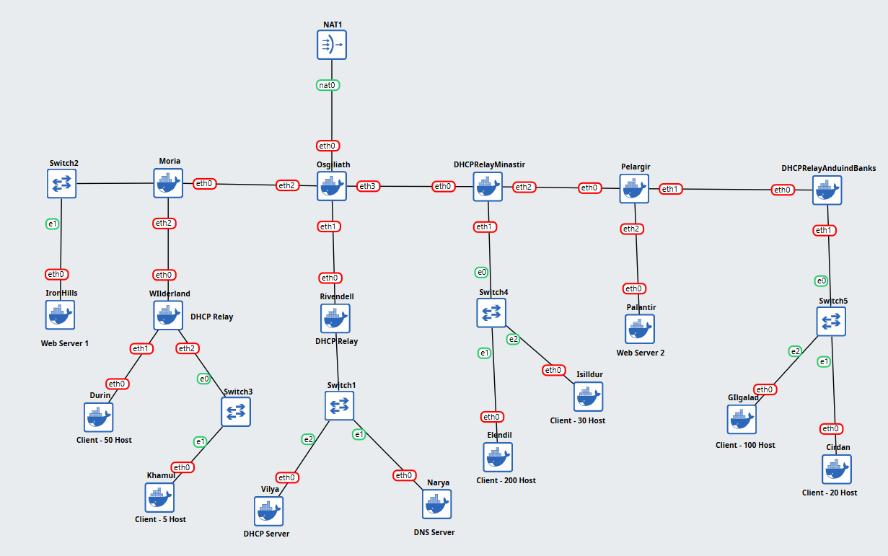
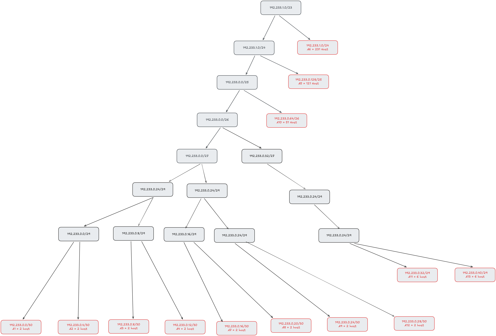
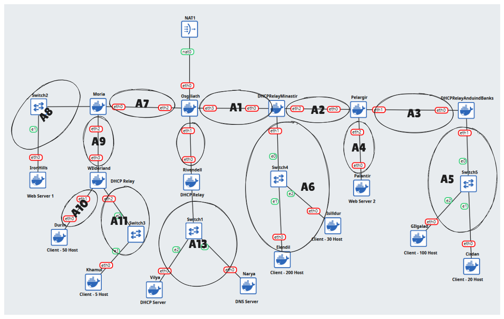

# Jarkom-Modul-5-2025-K44

No | Nama | NRP
-- | -- | --
1 | Ahmad Yazid Arifuddin | 5027241040
2 | Tiara Fatimah Azzahra   |   5027241090


# MISI & SOAL
## Misi 1: Memetakan Medan Perang

1. **Identifikasi Perangkat:**

   - **Narya:** Berfungsi sebagai DNS Server.
   - **Vilya:** Berfungsi sebagai DHCP Server.
   - **Web Servers:** **Palantir** dan **IronHills**.
   - **Client (Pasukan):**
     - **Khamul:** 5 host (Target/Burnice).
     - **Cirdan:** 20 host (Lycaon).
     - **Isildur:** 30 host (Policeboo).
     - **Durin:** 50 host (Caesar).
     - **Gilgalad:** 100 host (Ellen).
     - **Elendil:** 200 host (Jane).


| Kode | Network Address | Subnet Mask       | CIDR | Broadcast Address | Range Host                |
|------|------------------|-------------------|------|--------------------|----------------------------|
| A1   | 192.233.0.0      | 255.255.255.252   | /30 | 192.233.0.3        | 192.233.0.1 - 192.233.0.2  |
| A2   | 192.233.0.4      | 255.255.255.252   | /30 | 192.233.0.7        | 192.233.0.5 - 192.233.0.6  |
| A3   | 192.233.0.8      | 255.255.255.252   | /30 | 192.233.0.11       | 192.233.0.9 - 192.233.0.10 |
| A4   | 192.233.0.12     | 255.255.255.252   | /30 | 192.233.0.15       | 192.233.0.13 - 192.233.0.14 |
| A5   | 192.233.0.128    | 255.255.255.128   | /25 | 192.233.0.255      | 192.233.0.129 - 192.233.0.254 |
| A6   | 192.233.1.0      | 255.255.255.0     | /24 | 192.233.1.255      | 192.233.1.1 - 192.233.1.254 |
| A7   | 192.233.0.16     | 255.255.255.252   | /30 | 192.233.0.19       | 192.233.0.17 - 192.233.0.18 |
| A8   | 192.233.0.20     | 255.255.255.252   | /30 | 192.233.0.23       | 192.233.0.21 - 192.233.0.22 |
| A9   | 192.233.0.24     | 255.255.255.252   | /30 | 192.233.0.27       | 192.233.0.25 - 192.233.0.26 |
| A10  | 192.233.0.64     | 255.255.255.192   | /26 | 192.233.0.127      | 192.233.0.65 - 192.233.0.126 |
| A11  | 192.233.0.32     | 255.255.255.248   | /29 | 192.233.0.39       | 192.233.0.33 - 192.233.0.38 |
| A12  | 192.233.0.28     | 255.255.255.252   | /30 | 192.233.0.31       | 192.233.0.29 - 192.233.0.30 |
| A13  | 192.233.0.40     | 255.255.255.248   | /29 | 192.233.0.47       | 192.233.0.41 - 192.233.0.46 |




2. Setelah membagi alamat IP menggunakan VLSM (Prefix IP sesuai kelompok), gambarkan **pohon subnet** yang menunjukkan hierarki pembagian IP di jaringan Aliansi.  
   Lingkari subnet yang akan dilewati.





3. Buatlah konfigurasi rute untuk menghubungkan semua subnet dengan benar. Pastikan perangkat dapat saling terhubung.
   ##### Static Config
   ````
   cat << EOF > /etc/network/interfaces
   auto lo
   iface lo inet loopback

   auto (Interface)
   iface (Interface) inet static
      address (Ip Address)
      netmask (Subnet Mask)
   EOF
   ````


4. **Konfigurasi Service → Dikerjakan setelah Misi 2 No. 1:**

   - **Vilya** sebagai DHCP Server agar perangkat dalam Khamul, Durin, Gilgalad, Elendil, Cirdan, dan Isildur menerima IP otomatis.
   - **AnduinBanks, Rivendell, dan Minastri** berfungsi sebagai **DHCP Relay**.
   - **Narya** sebagai DNS Server.
   - **Palantir** dan **IronHills** sebagai Web Server (Apache/Nginx).
   - Buat **index.html** berisikan: `"Welcome to {hostname}"`.

---

## Misi 2: Menemukan Jejak Kegelapan (Security Rules)

Agar jaringan aman, terapkan aturan firewall berikut.

1. Agar jaringan Aliansi bisa terhubung ke luar (Valinor/Internet), konfigurasi routing menggunakan **iptables**.

   - **Syarat: Kalian TIDAK DIPERBOLEHKAN menggunakan target MASQUERADE.**

2. Karena **Vilya** (DHCP) menyimpan data vital, pastikan **tidak ada perangkat lain yang bisa melakukan PING ke Vilya**.

   - Namun, **Vilya tetap leluasa** dapat mengakses/ping ke seluruh perangkat lain.

3. Agar lokasi pasukan tidak bocor, **hanya Vilya yang dapat mengakses Narya (DNS)**.

   - Gunakan **nc (netcat)** untuk memastikan akses port DNS (53) ini.
   - *[Hapus aturan ini setelah pengujian agar internet lancar untuk install paket]*

4. Aktivitas mencurigakan terdeteksi di **IronHills**. Berdasarkan dekrit Raja, IronHills hanya boleh diakses pada **Akhir Pekan (Sabtu & Minggu)**.

   - Akses hanya diizinkan untuk **Faksi Kurcaci & Pengkhianat (Durin & Khamul)** serta **Faksi Manusia (Elendil & Isildur)**.
   - Karena hari ini adalah **Rabu** (simulasikan waktu server), mereka harusnya tertolak. Gunakan **curl** untuk membuktikan blokir waktu ini.

5. Sembari menunggu, pasukan berlatih di server **Palantir**. Akses dibatasi berdasarkan ras:

   - **Faksi Elf (Gilgalad & Cirdan):** Boleh akses jam **07.00 – 15.00**.
   - **Faksi Manusia (Elendil & Isildur):** Boleh akses jam **17.00 – 23.00**.
   - Gunakan **curl** untuk memastikan akses sesuai jam.

6. Pasukan Manusia (Elendil) diminta menguji keamanan **Palantir**. Lakukan simulasi port scan dengan **nmap** rentang port 1–100.

   - a. Web server harus memblokir scan port yang melebihi **15 port** dalam waktu **20 detik**.  
   - b. Penyerang yang terblokir **tidak dapat melakukan ping, nc, atau curl** ke Palantir.  
   - c. Catat log iptables dengan prefix **"PORT_SCAN_DETECTED"**.

7. Hari Sabtu tiba. Akses ke **IronHills** dibatasi untuk mencegah overload.

   - Akses ke IronHills hanya boleh berasal dari **3 koneksi aktif per IP** dalam waktu bersamaan.
   - Lakukan uji coba beban (**stress test**) menggunakan **curl** atau **ab**.

8. Selama uji coba, terdeteksi anomali. Setiap paket yang dikirim **Vilya** menuju **Khamul**, ternyata dibelokkan oleh sihir hitam menuju **IronHills**.

   - Gunakan **nc** untuk memastikan alur pengalihan ini (Redirect trafik dari Client ke Server).

---

## Misi 3: Isolasi Sang Nazgûl [|||||]

1. **Penjara Barad-dûr:** Mengetahui pengkhianatan Khamul, Aliansi mengambil langkah final:  
   **Blokir semua lalu lintas masuk dan keluar dari Khamul.**

   - Gunakan **nc** dan **ping** untuk membuktikan Khamul terisolasi total.
   - **Penting:** Yang diblokir adalah **Khamul (5 Host)**, **BUKAN Durin (50 Host)**. Jangan sampai salah sasaran.
